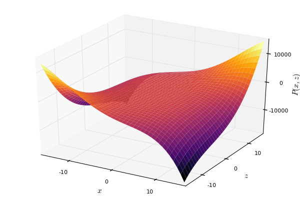

# Hermetic

[](https://travis-ci.org/gragusa/Hermetic.jl)


[](https://coveralls.io/github/gragusa/Hermetic.jl?branch=master)
[](http://codecov.io/github/gragusa/Hermetic.jl?branch=master)




## Description

`Hermetic` is a package for working with multivariate polynomial. The package may handle both standard polynomials and hermitian polynomials. 

## Install

The package is not at the moment registered on `Metadata` (although will soon be). It can however be installed by cloning the github repository:

```
Pkg.clone("https://github.com/gragusa/Hermetic.jl.git")
```

## Basic usage

There is a basic type: `Multivariatepolynomial{T}` where the parameter `T` is either `Standard` or `Hermitian`. 

### Standard multivariate polynomials

A fourth order polynomial of dimension 2 (that is, two variables) is instantiated by:

```
p = ProductPolynomial(2, 4)
```

```
ProductPolynomial{Standard} - Dimension: 2 - Order: 4
P(z) =
    + 1.0 z^(0,0)
    + 0.0 z^(0,1)
    + 0.0 z^(1,0)
    + 0.0 z^(0,2)
    + 0.0 z^(1,1)
    + 0.0 z^(2,0)
    + 0.0 z^(0,3)
    + 0.0 z^(1,2)
    + 0.0 z^(2,1)
    + 0.0 z^(3,0)
    + 0.0 z^(0,4)
    + 0.0 z^(1,3)
    + 0.0 z^(2,2)
    + 0.0 z^(3,1)
    + 0.0 z^(4,0)
```

The default constructor set all the coefficients equal to zero except the coefficient on `z^(0,0)`. Notice that the constructor leaves the polynomial uncompressed, that is, the constructor retains coefficients equal to zero.


Sometimes it can be useful only to consider terms whose exponents sum to an integer less than a given value. This is done using the `Iz` keyword. For instance, 

```
q = Productpolynomial(2, 4, Iz = 2)
```

In this case, the all the terms `z^(i,j)` with `i + j > Iz` are droppped from the poluynomial.

The coefficients of the polynomial are set using `setcoef!`

```
setcoef!(p, [1, .1, .2, 0.3, 0.4, 0.5, 0.6, 0.7, 0.8, 0.9, 1, 1.1, 1.2, 1.3, 1.4])
```

```
ProductPolynomial{Standard} - Dimension: 2 - Order: 4
P(z) =
    + 1.0 z^(0,0)
    + 0.1 z^(0,1)
    + 0.2 z^(1,0)
    + 0.3 z^(0,2)
    + 0.4 z^(1,1)
    + 0.5 z^(2,0)
    + 0.6 z^(0,3)
    + 0.7 z^(1,2)
    + 0.8 z^(2,1)
    + 0.9 z^(3,0)
    + 1.0 z^(0,4)
    + 1.1 z^(1,3)
    + 1.2 z^(2,2)
    + 1.3 z^(3,1)
    + 1.4 z^(4,0)
```

#### Operations 

The following operation are defined for `Standard` polynomials:

- addition `p + q`
- multiplication `p * q`
- scale `scale(p, a)`


These operations do compress the polynomial, that is they remove terms premultiplied by a zero coefficient. 

```
q = ProductPolynomial(2, 4)
setcoef!(q, [1, .0, 0, 0, 0, 0, 0, 0, 0, 0, 0, 0, 0, 0, 0.])
p * q
```

```
ProductPolynomial{Standard} - Dimension: 2 - Order: 4
P(z) =
    + 1.0 z^(0,0)
    + 0.1 z^(0,1)
    + 0.2 z^(1,0)
    + 0.3 z^(0,2)
    + 0.4 z^(1,1)
    + 0.5 z^(2,0)
    + 0.6 z^(0,3)
    + 0.7 z^(1,2)
    + 0.8 z^(2,1)
    + 0.9 z^(3,0)
    + 1.0 z^(0,4)
    + 1.1 z^(1,3)
    + 1.2 z^(2,2)
    + 1.3 z^(3,1)
    + 1.4 z^(4,0)
```

### Evaluating a polynomial

The polynomial can be evaluate by

```
eval(p, x::Array{Float64, 2})
```

For instance, to evaluate `p` at point `z = [1 2]`

```
evaluate(p, [1 2])
```

To evaluate the polynomial at different points
```
evaluate(p, [1 2; -.3 .3])
```


## Hermite polynomials

A multivariate Hermite polynomial is defined as a standard polynomial, but the terms are themselves Hermite polynomials. 

```
q = ProductPolynomial(Hermite, 2, 4)
```

```
ProductPolynomial{Hermite} - Dimension: 2 - Order: 4
P(z) =
    + 1.0 Hen(0,0)
    + 0.0 Hen(0,1)
    + 0.0 Hen(1,0)
    + 0.0 Hen(0,2)
    + 0.0 Hen(1,1)
    + 0.0 Hen(2,0)
    + 0.0 Hen(0,3)
    + 0.0 Hen(1,2)
    + 0.0 Hen(2,1)
    + 0.0 Hen(3,0)
    + 0.0 Hen(0,4)
    + 0.0 Hen(1,3)
    + 0.0 Hen(2,2)
    + 0.0 Hen(3,1)
    + 0.0 Hen(4,0)
```

`Hen(j,i) = Hen(j)*Hen(i)` and `Hen(j)` is the (probabilistic) Hermite polynomial of order `j`. 

A `ProductPolynomial{Hermite}` can be converted to a standard one by `convert(ProductPolynomial{Standard}, q::ProductPolynomial{Hermite})`.

The same operations defined for `Standard` polynomials apply to `Hermite` polynomials, but the return type of these operations is `ProductPolynomial{Standard}`. 


## License and credits

The `Hermite` polynomial is under the LGPL license. 

Most of the credit for this package should go to [John Burkardt](http://people.sc.fsu.edu/~jburkardt/) and his code [multivariate polynomials](http://people.sc.fsu.edu/~jburkardt/c_src/hermite_product_polynomial/hermite_product_polynomial.html). 

Of course, I will shoulder most of the blame for errors and omissions.


